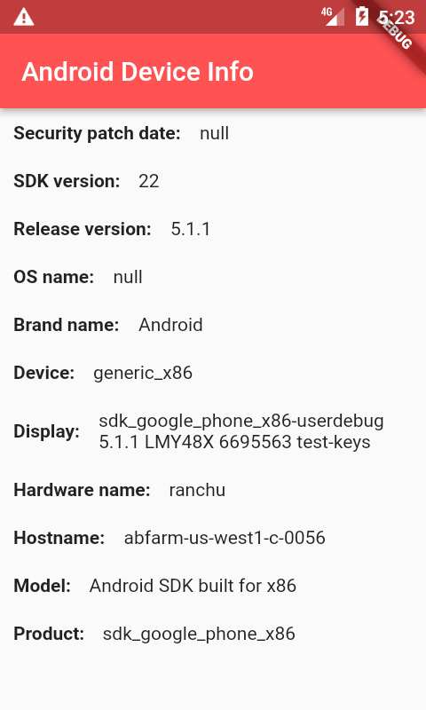

# android_ios_device_info_flutter

Flutter Android/iOS device info app
## About The Project

The operating system under which the application is executed is determined, and then the system information is read into the corresponding AndroidDeviceInfo or IosDeviceInfo class. This information is then displayed on the screen.
Used by DeviceInfoPlugin.
